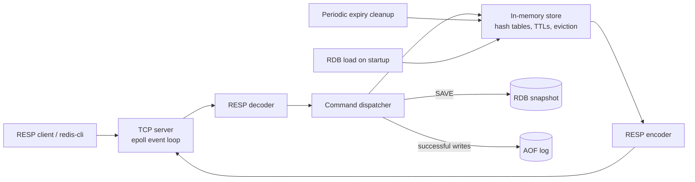

# Aster

> A small Redis-compatible, in-memory database written in Go.

Aster started as a way to understand what sits underneath a Redis-like server. The goal was to build the interesting parts myself: RESP parsing, a TCP server built around `epoll`, expiry, incremental rehashing, eviction, and a little persistence. It is not trying to replace Redis; it is a compact project for learning how those pieces fit together.

It currently stores strings and speaks RESP2, so you can point `redis-cli` at it for the commands listed below.

## What is here

- A non-blocking TCP server built with Linux `epoll`
- RESP2 encoding and streaming decoding, including pipelined commands
- String keys with TTLs, lazy expiry, and periodic expiry cleanup
- Incremental hash-table rehashing
- Approximate LRU and LFU eviction
- RDB-style snapshots and an append-only write log

## Architecture



## Commands

| Command | What it does |
| --- | --- |
| `PING [message]` | Returns `PONG`, or echoes the message. |
| `SET key value [EX seconds]` | Stores a string. `EX` sets a TTL in seconds. |
| `GET key` | Reads a string, or returns a null bulk string. |
| `DEL key [key ...]` | Deletes keys and returns how many were removed. |
| `EXPIRE key seconds` | Sets a key TTL. |
| `TTL key` | Returns seconds left, `-1` without an expiry, or `-2` when absent. |
| `INCR key` | Increments an integer string; creates it at `1` when missing. |
| `SAVE` | Writes the current data to the configured RDB file. |

## Running it

You need Go 1.26+ and Linux—the server uses Linux system calls and `epoll`.

```bash
git clone https://github.com/devanshu0x/Aster.git
cd Aster
go run .
```

By default, Aster listens on `0.0.0.0:6969`. For a local-only server:

```bash
go run . -host 127.0.0.1 -port 6969
```

Then try it with `redis-cli`:

```bash
redis-cli -p 6969 PING
redis-cli -p 6969 SET greeting hello EX 60
redis-cli -p 6969 GET greeting
redis-cli -p 6969 TTL greeting
```

## Configuration

Everything is a command-line flag. `go run . -help` shows the same list from the running binary.

| Flag | Default | Meaning |
| --- | --- | --- |
| `-host` | `0.0.0.0` | IPv4 address to bind. |
| `-port` | `6969` | TCP port to listen on. |
| `-max-objects` | `10` | Number of keys at which Aster tries to evict one. |
| `-eviction-policy` | `noeviction` | `noeviction`, `lru`, or `lfu`. |
| `-sample-size` | `2` | Number of candidates considered for approximate eviction. |
| `-hash-table-size` | `2` | Initial hash-table bucket count. |
| `-lfu-init-val` | `5` | Starting LFU counter value. |
| `-lfu-log-factor` | `10` | How slowly the LFU counter grows. |
| `-decay-time` | `1` | LFU counter decay interval, in minutes. |
| `-rdb-path` | `./data/dump.rdb` | File read at startup and written by `SAVE`. |
| `-load-rdb-on-start` | `true` | Whether to load that snapshot at startup. |
| `-aof-path` | `./data/appendonly.aof` | Append-only log location. |
| `-use-aof` | `true` | Whether to append successful writes to the AOF. |

For example, here is a local LRU cache with room for 1,000 keys:

```bash
go run . \
  -host 127.0.0.1 \
  -max-objects 1000 \
  -eviction-policy lru
```

## A few things to know

- This is a learning project and is best used locally.
- The AOF is written to, but not replayed on startup yet. If you want data back after a restart, run `SAVE` and keep the RDB file.
- Only numeric IPv4 addresses are accepted for `-host` at the moment.
- There is still plenty of production work left: graceful shutdown, authentication, replication, complete Redis command compatibility, and proper `EPOLLOUT` handling when a non-blocking write would block.

## Layout

```text
internal/
  command/      command parsing and implementations
  config/       runtime configuration
  persistence/  RDB and AOF code
  resp/         RESP2 encoder and decoder
  server/       TCP server and epoll loop
  store/        dictionary, expiry, rehashing, and eviction
```

## Development

```bash
go test ./...
```
